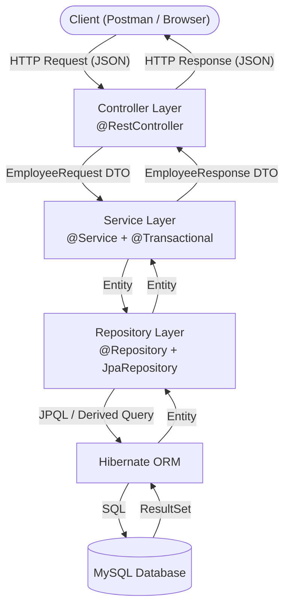
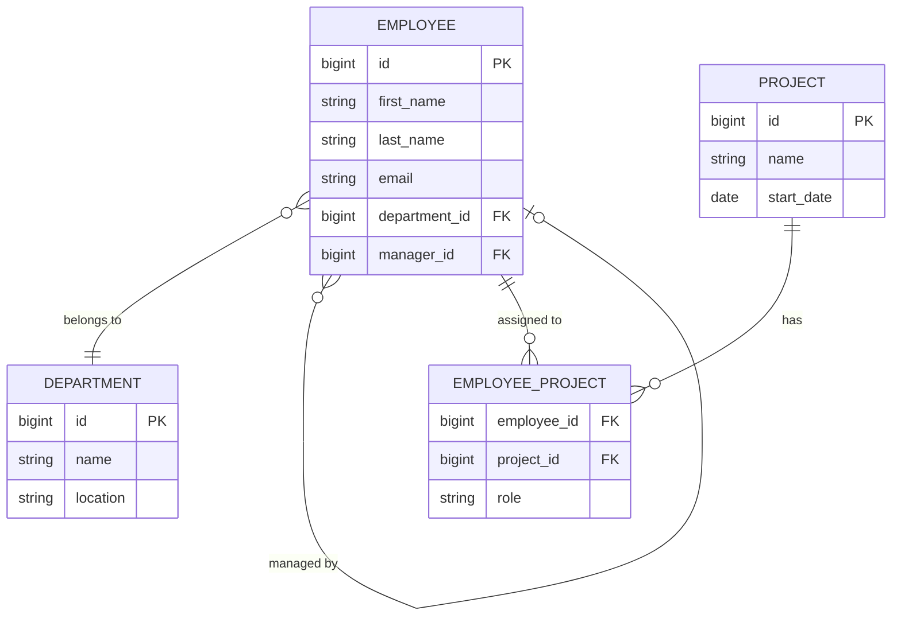

# Employee Management System

A production-style REST API built with Java 17, Spring Boot 3, and MySQL. Demonstrates layered architecture, REST design, JPA/Hibernate, Bean Validation, global exception handling, unit testing, and API documentation.

---

## Architecture



### Request Lifecycle — `POST /api/employees`

```
1. Client sends HTTP POST with JSON body
2. DispatcherServlet routes to EmployeeController.createEmployee()
3. @Valid triggers Hibernate Validator on EmployeeRequest
   └─ If invalid → MethodArgumentNotValidException → GlobalExceptionHandler → 400
4. Controller calls employeeService.createEmployee(request)
5. Service checks for duplicate email via repository.existsByEmail()
   └─ If duplicate → DuplicateEmailException → GlobalExceptionHandler → 409
6. Service calls mapper.toEntity(request) → Employee entity
7. Service calls repository.save(employee) → Hibernate issues INSERT
8. MySQL assigns AUTO_INCREMENT id, sets created_at and updated_at
9. Service calls mapper.toResponse(savedEmployee) → EmployeeResponse
10. Controller returns ResponseEntity with 201 CREATED + EmployeeResponse JSON
```

### Request Lifecycle — `GET /api/employees/{id}`

```
1. Client sends HTTP GET /api/employees/5
2. DispatcherServlet routes to EmployeeController.getEmployeeById(5)
3. Controller calls employeeService.getEmployeeById(5)
4. Service calls repository.findById(5) → Optional<Employee>
   └─ If empty → EmployeeNotFoundException → GlobalExceptionHandler → 404
5. Service calls mapper.toResponse(employee) → EmployeeResponse
6. Controller returns ResponseEntity with 200 OK + EmployeeResponse JSON
```

---

## Tech Stack

| Category | Technology |
|---|---|
| Language | Java 17 |
| Framework | Spring Boot 3.2.5 |
| Web | Spring MVC |
| Persistence | Spring Data JPA + Hibernate 6 |
| Database | MySQL 8 |
| Build Tool | Maven |
| Validation | Hibernate Validator (Bean Validation 3.0) |
| Boilerplate | Lombok |
| Testing | JUnit 5 + Mockito + MockMvc |
| Documentation | SpringDoc OpenAPI 3 (Swagger UI) |
| Connection Pool | HikariCP |

---

## Project Structure

```
src/main/java/com/example/employeemanagement/
│
├── config/
│   └── OpenApiConfig.java          # Swagger/OpenAPI configuration
│
├── controller/
│   └── EmployeeController.java     # REST endpoints, HTTP layer only
│
├── service/
│   ├── EmployeeService.java        # Business contract (interface)
│   └── EmployeeServiceImpl.java    # Business logic implementation
│
├── repository/
│   └── EmployeeRepository.java     # Data access, derived + custom queries
│
├── entity/
│   └── Employee.java               # JPA entity, maps to employees table
│
├── dto/
│   ├── EmployeeRequest.java        # Inbound DTO with validation annotations
│   └── EmployeeResponse.java       # Outbound DTO for API responses
│
├── exception/
│   ├── EmployeeNotFoundException.java   # 404 custom exception
│   ├── DuplicateEmailException.java     # 409 custom exception
│   ├── GlobalExceptionHandler.java      # @RestControllerAdvice
│   └── ErrorResponse.java              # Structured error response shape
│
├── mapper/
│   └── EmployeeMapper.java         # Converts between Request, Entity, Response
│
└── EmployeeManagementApplication.java  # Entry point
```

---

## Database Schema

```sql
CREATE TABLE employees (
    id           BIGINT          NOT NULL AUTO_INCREMENT,
    first_name   VARCHAR(100)    NOT NULL,
    last_name    VARCHAR(100)    NOT NULL,
    email        VARCHAR(255)    NOT NULL,
    phone_number VARCHAR(20),
    department   VARCHAR(100)    NOT NULL,
    job_title    VARCHAR(100)    NOT NULL,
    salary       DECIMAL(15, 2),
    hire_date    DATE,
    created_at   DATETIME(6)     NOT NULL,
    updated_at   DATETIME(6)     NOT NULL,
    PRIMARY KEY (id),
    CONSTRAINT uk_employee_email UNIQUE (email)
);
```

### Design Decisions

- `BIGINT` for `id` — supports billions of rows, never use `INT` for primary keys
- `DECIMAL(15,2)` for `salary` — exact decimal arithmetic, never use `FLOAT`/`DOUBLE` for money
- `DATE` for `hire_date` — date only, no time component needed
- `DATETIME(6)` for timestamps — microsecond precision audit fields
- Named unique constraint `uk_employee_email` — better error messages than unnamed constraints

### Future Schema Expansion



---

## API Endpoints

| Method | Endpoint | Description | Status Codes |
|---|---|---|---|
| `POST` | `/api/employees` | Create a new employee | 201, 400, 409 |
| `GET` | `/api/employees` | Get all employees | 200 |
| `GET` | `/api/employees/{id}` | Get employee by ID | 200, 404 |
| `PUT` | `/api/employees/{id}` | Update employee | 200, 400, 404, 409 |
| `DELETE` | `/api/employees/{id}` | Delete employee | 204, 404 |
| `GET` | `/api/employees/search?keyword=` | Search by name or email | 200 |
| `GET` | `/api/employees/department/{dept}` | Filter by department | 200 |

---

## Request / Response Examples

### Create Employee

**Request**
```http
POST /api/employees
Content-Type: application/json

{
  "firstName": "John",
  "lastName": "Smith",
  "email": "john.smith@example.com",
  "phoneNumber": "9876543210",
  "department": "Engineering",
  "jobTitle": "Software Engineer",
  "salary": 75000.00,
  "hireDate": "2024-01-15"
}
```

**Response — 201 Created**
```json
{
  "id": 1,
  "firstName": "John",
  "lastName": "Smith",
  "email": "john.smith@example.com",
  "phoneNumber": "9876543210",
  "department": "Engineering",
  "jobTitle": "Software Engineer",
  "salary": 75000.00,
  "hireDate": "2024-01-15",
  "createdAt": "2024-08-14T17:30:00",
  "updatedAt": "2024-08-14T17:30:00"
}
```

### Validation Error

**Request**
```json
{
  "firstName": "",
  "email": "notanemail",
  "salary": -500
}
```

**Response — 400 Bad Request**
```json
{
  "timestamp": "2024-08-14T17:30:00",
  "status": 400,
  "error": "Validation Failed",
  "message": "Request contains invalid fields",
  "path": "/api/employees",
  "fieldErrors": {
    "firstName": "First name is required",
    "email": "Email must be a valid email address",
    "salary": "Salary must be a positive value",
    "lastName": "Last name is required",
    "department": "Department is required",
    "jobTitle": "Job title is required",
    "hireDate": "Hire date is required"
  }
}
```

### Not Found Error

**Response — 404 Not Found**
```json
{
  "timestamp": "2024-08-14T17:30:00",
  "status": 404,
  "error": "Employee Not Found",
  "message": "Employee with ID 99 not found",
  "path": "/api/employees/99"
}
```

### Duplicate Email Error

**Response — 409 Conflict**
```json
{
  "timestamp": "2024-08-14T17:30:00",
  "status": 409,
  "error": "Duplicate Email",
  "message": "An employee with email 'john.smith@example.com' already exists",
  "path": "/api/employees"
}
```

---

## How to Run

### Prerequisites

- Java 17+
- Maven 3.8+
- MySQL 8+

### Setup

**1. Clone the repository**
```bash
git clone https://github.com/vigneshsai4202/Employee-Mangement-System.git
cd employee-management-system
```

**2. Create the database**
```sql
CREATE DATABASE employee_db;
```

**3. Configure credentials**

Open `src/main/resources/application.properties` and update:
```properties
spring.datasource.password=${DB_PASSWORD:your_password}
```

Or set environment variables (recommended):
```bash
set DB_URL=jdbc:mysql://localhost:3306/employee_db?createDatabaseIfNotExist=true&useSSL=false&serverTimezone=UTC&allowPublicKeyRetrieval=true
set DB_USERNAME=root
set DB_PASSWORD=your_password
```

**4. Run the application**
```bash
mvn spring-boot:run
```

**5. Verify startup**

Look for:
```
Started EmployeeManagementApplication in X.XXX seconds
```

### Access Points

| URL | Description |
|---|---|
| `http://localhost:8080/api/employees` | REST API base URL |
| `http://localhost:8080/swagger-ui/index.html` | Swagger UI |
| `http://localhost:8080/api-docs` | Raw OpenAPI JSON |

---

## Running Tests

```bash
# Run all tests
mvn test

# Run only service tests
mvn test -Dtest=EmployeeServiceImplTest

# Run only controller tests
mvn test -Dtest=EmployeeControllerTest
```

Expected output:
```
Tests run: 23, Failures: 0, Errors: 0, Skipped: 0
```

---

## Environment Variables

| Variable | Description | Default |
|---|---|---|
| `DB_URL` | Full JDBC connection URL | `jdbc:mysql://localhost:3306/employee_db...` |
| `DB_USERNAME` | MySQL username | `root` |
| `DB_PASSWORD` | MySQL password | *(must be set)* |

---

## Exception Handling

All exceptions are handled centrally by `GlobalExceptionHandler` using `@RestControllerAdvice`.

| Exception | HTTP Status | Trigger |
|---|---|---|
| `EmployeeNotFoundException` | 404 Not Found | ID doesn't exist |
| `DuplicateEmailException` | 409 Conflict | Email already taken |
| `MethodArgumentNotValidException` | 400 Bad Request | Bean validation fails |
| `DataIntegrityViolationException` | 409 Conflict | DB constraint violated |
| `Exception` | 500 Internal Server Error | Unexpected error |

Stack traces are never exposed to API clients.

---

## Key Design Decisions

**Why DTOs instead of exposing entities?**
Entities are tied to the database schema. Exposing them directly couples your API contract to your DB structure, leaks internal fields, and prevents independent evolution of both layers.

**Why constructor injection instead of `@Autowired` on fields?**
Constructor injection makes dependencies explicit, enables `final` fields (immutability), and allows instantiation without Spring (critical for unit testing).

**Why `@Transactional(readOnly = true)` on read methods?**
Hibernate skips dirty checking for read-only transactions, improving performance. Some databases also apply read optimizations for read-only transactions.

**Why `existsByEmailAndIdNot` for updates?**
`existsByEmail` alone would block an employee from keeping their own email during an update. The `AndIdNot` clause excludes the current employee from the uniqueness check.

---

## Future Improvements

- [ ] Pagination and sorting on `GET /api/employees` using `Pageable`
- [ ] Spring Security with JWT authentication
- [ ] Department entity with `@ManyToOne` relationship
- [ ] Flyway for database migration management
- [ ] Docker + Docker Compose for containerized deployment
- [ ] GitHub Actions CI/CD pipeline
- [ ] Integration tests with `@SpringBootTest` and Testcontainers
- [ ] Caching with Spring Cache + Redis
- [ ] Actuator endpoints for health monitoring

---

## Interview Questions Based on This Project

1. What is the difference between `@Component`, `@Service`, `@Repository`, and `@Controller`?
2. How does Spring Data JPA generate SQL from method names like `findByDepartment`?
3. What is the difference between JDBC, JPA, Hibernate, and Spring Data JPA?
4. Why do we use DTOs instead of exposing JPA entities directly?
5. How does `@Transactional` work internally in Spring?
6. What is the difference between `@Mock` and `@MockBean`?
7. Why is constructor injection preferred over field injection?
8. What does `@RestControllerAdvice` do and how does it work?
9. Why use `BigDecimal` for salary instead of `double`?
10. What is the difference between `@NotNull`, `@NotEmpty`, and `@NotBlank`?
11. How does HikariCP connection pooling work?
12. What is dirty checking in Hibernate?
13. Why is `Optional` used as a return type in repository methods?
14. What is the difference between `PUT` and `PATCH`?
15. How does `@WebMvcTest` differ from `@SpringBootTest`?

---

## Resume Bullet Points

- Built a production-style Employee Management REST API using Java 17, Spring Boot 3, and MySQL, implementing full CRUD operations with layered architecture (Controller → Service → Repository)
- Implemented global exception handling with `@RestControllerAdvice`, returning structured JSON error responses with appropriate HTTP status codes (400, 404, 409, 500)
- Applied Bean Validation (JSR-380) with custom error messages, preventing invalid data from reaching the service layer
- Wrote 23 unit and integration tests using JUnit 5, Mockito, and MockMvc achieving meaningful coverage of business logic and HTTP behavior
- Designed a DTO pattern separating API contracts from JPA entities, preventing internal data exposure and enabling independent evolution of layers
- Documented all REST endpoints using SpringDoc OpenAPI 3 (Swagger UI), enabling interactive API testing without Postman
- Used Spring Data JPA derived queries and custom JPQL for employee search and department filtering, eliminating boilerplate SQL
